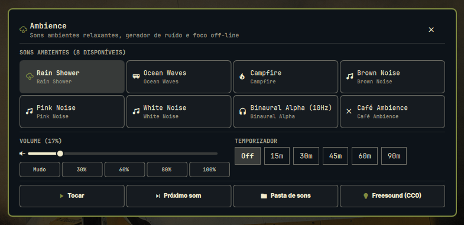

# Ambience for Omarchy 🌧️🎧

Offline ambient soundscapes, procedural noise generator, and focus sound player for [Omarchy](https://omarchy.org/).

<p align="center">
  
</p>

---

## ✨ Features

- **⚡ 100% Offline & Ultra-Lightweight**: Generates soundscapes in real-time via mathematical DSP synthesis (~0.2% CPU), with zero internet connection required and zero trackers.
- **🎧 8 Built-in Soundscapes**:
  - 🌧️ **Rain Shower**: Soothing rainfall with stochastic droplet impacts.
  - 🌊 **Ocean Waves**: Deep oceanic surf with 11-second natural wave cycles.
  - 🔥 **Campfire**: Cozy wood fire with warm pops and crackles.
  - 🟫 **Brown Noise**: Deep Brownian rumble (ideal for deep focus, office masking, and ADHD).
  - 🌸 **Pink Noise**: Balanced 1/f soothing natural spectrum.
  - ⚪ **White Noise**: Crisp static noise for total frequency masking.
  - 🧠 **Binaural Beats (Alpha 10Hz)**: Stereo-separated frequencies (200Hz left / 210Hz right) to induce focus.
  - ☕ **Café Ambience**: Warm coffee shop acoustic resonance.
- **📁 Custom Audio Loops**: Drop your own `.ogg`, `.mp3`, or `.wav` files into `sounds/` to play personal tracks seamlessly.
- **🖥️ Centered Modal Window**:
  - Large centered card (760px) with backdrop scrim.
  - 4-column Soundscape selection cards with active playing badges.
  - Fluid volume slider (0% - 100%) + quick presets (Mute, 30%, 60%, 80%, 100%).
  - **Sleep Timer**: Auto-off countdown (Off, 15m, 30m, 45m, 60m, 90m).
  - Quick access to open local sounds folder and Freesound CC0 catalog.
  - Press `Esc` to close immediately.
- **🪄 Smart Auto-Hide Top Bar Widget**:
  - Automatically hidden from the top bar when stopped/inactive.
  - Dynamically appears on the top bar when audio is playing, showing the active sound name, volume, and timer countdown.
- **🖱️ Bar Controls (When Playing)**:
  - **Left-Click**: Play / Pause toggle.
  - **Mouse Wheel**: Smooth volume adjustment up / down (+/- 5%).
  - **Middle-Click**: Quick-cycle to the next sound preset.
  - **Right-Click**: Opens the **Ambience** modal.
- **🎨 Omarchy Theme Integration**: Seamlessly follows system colors (`bar.urgent`, `bar.foreground`, `bar.fontFamily`).

---

## ⌨️ Shortcuts & Controls

| Shortcut / Action | Function | Description |
|---|---|---|
| <kbd>Super</kbd> + <kbd>Ctrl</kbd> + <kbd>Alt</kbd> + <kbd>A</kbd> | **Open Ambience** | Opens the centered Ambience modal |
| <kbd>Super</kbd> + <kbd>Alt</kbd> + <kbd>A</kbd> | **Play / Pause** | Toggles ambient sound playback instantly |
| <kbd>Esc</kbd> | **Close Modal** | Dismisses the centered modal |
| **Scroll Wheel on Bar** | **Volume +/-** | Adjusts volume by 5% when active |
| **Middle-Click on Bar** | **Next Sound** | Advances to the next soundscape preset |

---

## 🌐 Open Source Sound Resources & Custom Loops

You can add your own soundscapes to Ambience simply by dropping `.ogg`, `.mp3`, `.wav`, or `.flac` files into:

```bash
~/.config/omarchy/plugins/dorneles.ambience/sounds/
```

The plugin will automatically detect them and add them as selectable cards in the **Ambience** window!

### Recommended Free & Open Source Audio Repositories:
- **[Freesound.org (CC0 Sounds)](https://freesound.org/search/?q=ambient+loop&f=license%3A%22Creative+Commons+0%22)**: Thousands of public domain nature loops, rain, wind, and city soundscapes.
- **[Wikimedia Commons Audio](https://commons.wikimedia.org/wiki/Category:Audio_files)**: High-quality public domain field recordings.
- **[Internet Archive Audio Archive](https://archive.org/details/audio)**: Extensive library of free ambient recordings.

---

## 📋 Requirements & Dependencies

- **PipeWire / ALSA**: `aplay` or `pw-play` (pre-installed on Omarchy/Arch).
- **Python 3**: (pre-installed) for real-time DSP mathematical audio synthesis.
- **mpv**: (optional) used for playing custom `.ogg`/`.mp3` files if placed in `sounds/`.
- **Nerd Fonts**: (pre-installed) for status bar icons.

---

## 📦 Installation

### Automated Installation (Recommended)

Clone and run the included installer:

```bash
git clone https://github.com/jvlianodorneles/ambience.git ~/.config/omarchy/plugins/dorneles.ambience
cd ~/.config/omarchy/plugins/dorneles.ambience
./install.sh
```

The installer automatically configures `shell.json`, Hyprland keybindings, and Omarchy menu entries.

---

## 🗑️ Removal / Uninstallation

To remove the plugin from Omarchy:

```bash
omarchy plugin disable dorneles.ambience 2>/dev/null || true
rm -rf ~/.config/omarchy/plugins/dorneles.ambience
omarchy-shell shell rescanPlugins
```

---

## ⚙️ Configuration (`~/.config/omarchy/shell.json`)

```json
{
  "id": "dorneles.ambience",
  "mode": "active-only",
  "defaultPreset": "rain",
  "defaultVolume": 60,
  "showLabel": true
}
```

---

## 📄 License

This project is licensed under the [MIT License](LICENSE).
